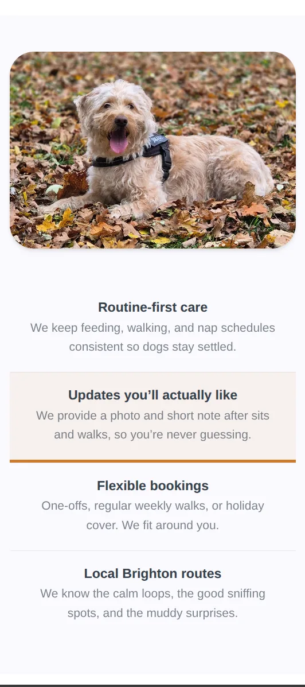

# Sit Happens

A responsive website for a Brighton-based dog sitting and walking service.

Built by Alex, Emma, and Kristy as part of the TechNative Digital advanced software development course.

## Overview

Sit Happens presents a friendly, modern experience for a local dog sitting and walking business, with clear calls to action, service highlights, and community-focused messaging.

## Pages

- Home (`index.html`)
- Services (`services.html`)
- About + Contact (`about.html`)
- Gallery (`gallery.html`)

## Features

- Responsive layout with mobile navigation
- Interactive highlights and testimonials on the home page
- “View more” toggle on services
- Contact form 
- Gallery populated via The Dog API

## Tech Stack

- HTML5
- CSS3 (modular component styles)
- Vanilla JavaScript
- The Dog API (gallery data)

## Mobile View

